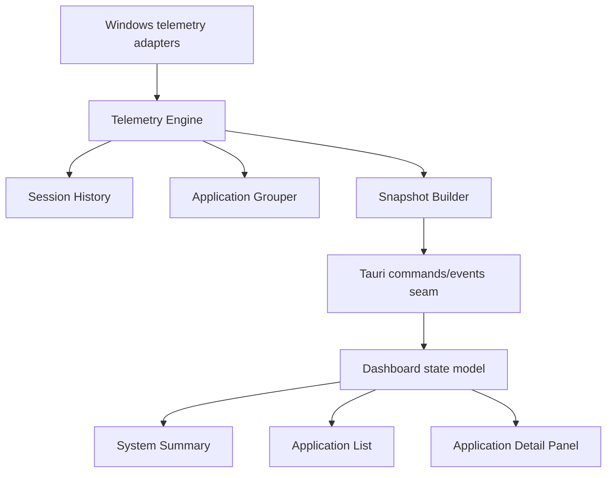

# Aeon Architecture

This document describes the target structure for Aeon v1: a Windows-only, read-only performance diagnostics dashboard for CPU, RAM, GPU, GPU memory, and optional temperature.

It is intentionally shaped around **deep modules**: small interfaces that hide the awkward parts of Windows telemetry, application grouping, session history, and frontend synchronization.

## Architectural goals

Aeon v1 should:

- collect live machine and application telemetry on Windows
- group raw processes into user-facing applications when possible
- maintain recent **session-local** history in memory only
- present one dashboard with system summary, ranked application list, and a side panel
- keep the frontend focused on presentation, not telemetry math
- keep the backend focused on telemetry, grouping, history, and snapshot assembly

Aeon v1 should **not**:

- persist long-term history
- mutate system state
- send alerts or notifications
- expose raw process complexity as the primary user model

---

## Recommended architectural shape

### Core idea

Put the **telemetry engine** in Rust behind a small interface.

That module should own:

- sampling
- grouping
- session history
- snapshot assembly
- refresh / pause behavior

The React frontend should consume already-shaped snapshots and render them.

That gives Aeon one deep backend module with high leverage instead of scattering telemetry logic across Tauri commands, event handlers, and React state.

---

## High-level runtime model



### Data flow

1. Windows adapters collect raw machine and process telemetry.
2. The telemetry engine normalizes that data.
3. The application grouper rolls raw processes into user-facing applications.
4. Session history stores recent in-memory points.
5. The snapshot builder creates one frontend-friendly view model.
6. Tauri exposes that snapshot to React through commands and events.
7. React renders the dashboard and sends back user setting changes.

---

## Primary seam

The most important seam is:

**Frontend dashboard ↔ Telemetry engine**

The interface across that seam should stay small.

### Recommended interface

The frontend should not ask for CPU, RAM, GPU, grouping, and history separately.
Instead, it should ask for a **dashboard snapshot** and send **settings updates**.

Good interface shape:

- `get_dashboard_bootstrap() -> DashboardBootstrap`
- `update_monitoring_settings(settings) -> DashboardSettings`
- `select_application(application_id) -> ApplicationDetailSnapshot` (optional if already included in the main snapshot)
- event: `dashboard_snapshot_updated`

Bad interface shape:

- `get_cpu_usage()`
- `get_ram_usage()`
- `get_gpu_usage()`
- `get_processes()`
- `get_history()`
- `group_processes()`

That bad shape is shallow: it forces the frontend to rebuild the product logic itself.

---

## Recommended modules

## Rust backend (`src-tauri`)

### 1. Telemetry Engine

This should be the deepest module in the codebase.

**Responsibility**

Own the monitoring loop and expose frontend-ready snapshots.

**Interface**

- start / initialize monitoring state
- apply refresh preset or pause
- return current dashboard snapshot
- emit updated snapshots

**Implementation should hide**

- raw Windows polling details
- sysinfo quirks
- GPU adapter quirks
- optional temperature availability
- grouping heuristics
- session ring buffers
- snapshot ranking and shaping

### 2. Windows Telemetry Adapter

**Responsibility**

Collect raw system and process telemetry from Windows-specific sources.

**Notes**

- `sysinfo` can likely cover CPU, RAM, and some process information
- GPU and temperature may require additional Windows-specific adapters later
- temperature should be optional from the start in the type model

This should be an adapter *inside* the telemetry engine, not a seam the frontend knows about.

### 3. Application Grouper

**Responsibility**

Turn raw process/process-tree data into user-facing applications.

**Why this deserves its own module**

This is product logic, not OS plumbing.
It will likely evolve independently from the sampler.

**Likely heuristics**

- executable path
- process name
- parent/child relationships
- window ownership when available
- known multi-process application families

### 4. Session History

**Responsibility**

Maintain recent in-memory time-series data for:

- system-wide metrics
- grouped application metrics

**Recommended structure**

Use bounded ring buffers keyed by:

- resource kind for machine-wide history
- application id + resource kind for app history

This keeps history local, finite, and independent from persistence.

### 5. Snapshot Builder

**Responsibility**

Transform internal telemetry state into frontend-ready snapshots.

This is where Aeon becomes a product rather than a telemetry dump.

It should decide:

- list ordering by selected ranking resource
- mini chart extraction
- current metric formatting units or raw values
- optional fields such as temperature availability
- side-panel shape for the selected application

### 6. Tauri Bridge

**Responsibility**

Expose a tiny command/event surface to React.

This should stay thin.
Its job is transport, not telemetry logic.

---

## Frontend (`src`)

The frontend should be organized around the dashboard product flow, not around generic shared folders too early.

### 1. Dashboard State Model

**Responsibility**

Own the current dashboard state in React:

- latest snapshot
- selected ranking resource
- selected refresh preset
- paused/running state
- selected application id
- loading / unavailable metric states

This can likely be implemented with React context + reducer or a custom hook. A heavier state library is probably unnecessary for v1.

### 2. System Summary Module

**Responsibility**

Render machine-wide current metrics and recent mini charts.

### 3. Application List Module

**Responsibility**

Render the ranked app list with:

- app identity
- current CPU/RAM/GPU/GPU memory values
- mini charts
- selection behavior

### 4. Application Detail Panel Module

**Responsibility**

Render the selected app’s:

- current metrics
- larger recent chart
- metadata

### 5. Monitoring Controls Module

**Responsibility**

Render and update:

- refresh preset
- paused state
- ranking resource

These modules should stay presentation-focused. They should not implement telemetry calculations locally.

---

## Recommended directory structure

## Backend

```text
src-tauri/src/
  lib.rs
  app/
    mod.rs
    run.rs
    state.rs
    commands.rs
    events.rs
  telemetry/
    mod.rs
    engine.rs
    models.rs
    snapshot.rs
    history.rs
    grouping.rs
    presets.rs
    adapters/
      mod.rs
      windows.rs
      sysinfo.rs
      gpu.rs
      temperature.rs
```

### Why this shape

- `app/` owns Tauri wiring
- `telemetry/` owns product telemetry behavior
- `adapters/` isolates OS/library-specific collection details
- avoids shallow buckets like `_structs`, `_enums`, `states`, `events`, `commands` at the root

### Recommendation about current backend folders

The current root-level folders in `src-tauri/src/` such as:

- `_enums`
- `_structs`
- `commands`
- `events`
- `states`
- `database`
- `sessions`

are likely too bucketed for this stage unless they already hide deep behavior.

Prefer organizing by **module ownership** instead of by noun type.

For example:

- good: `telemetry/history.rs`
- weaker: `states/history_state.rs`

- good: `telemetry/grouping.rs`
- weaker: `_structs/application_group.rs`

### About `database/`

Your MVP currently uses **session-only in-memory history**.
So a database module is probably premature unless you already know you need it for later experiments.

If not in use yet, treat it as future scope and keep it disconnected from v1.

---

## Frontend

```text
src/
  app/
    App.tsx
    bootstrap.ts
    dashboard-store.ts
  features/
    dashboard/
      DashboardPage.tsx
      DashboardLayout.tsx
    system-summary/
      SystemSummary.tsx
      SystemMetricCard.tsx
      SystemMiniChart.tsx
    application-list/
      ApplicationList.tsx
      ApplicationRow.tsx
      ApplicationMiniChart.tsx
    application-detail/
      ApplicationDetailPanel.tsx
      ApplicationMetadata.tsx
      ApplicationHistoryChart.tsx
    monitoring-controls/
      MonitoringControls.tsx
  shared/
    tauri/
      dashboard-client.ts
    format/
      metrics.ts
    ui/
      ...
  types/
    dashboard.ts
```

### Why this shape

- feature folders map directly to the user-facing dashboard
- shared code stays small and obviously reusable
- Tauri transport logic stays out of visual modules
- frontend types stay aligned with the dashboard snapshot seam

---

## Recommended type model

The key is to keep one coherent snapshot model.

### Core backend/frontend shared concepts

```text
DashboardSnapshot
  machine: MachineSnapshot
  applications: ApplicationSnapshot[]
  selectedApplication: ApplicationDetailSnapshot | null
  settings: DashboardSettings
  collectedAt: timestamp

MachineSnapshot
  cpu: ResourceMetric
  ram: ResourceMetric
  gpu: ResourceMetric | null
  gpuMemory: ResourceMetric | null
  temperature: TemperatureMetric | null

ApplicationSnapshot
  id: string
  name: string
  processCount: number
  executablePath: string | null
  cpu: ResourceMetric | null
  ram: ResourceMetric | null
  gpu: ResourceMetric | null
  gpuMemory: ResourceMetric | null
  miniHistory: MiniHistory

ApplicationDetailSnapshot
  id: string
  name: string
  processCount: number
  executablePath: string | null
  current: ApplicationResourceSet
  recentHistory: DetailedHistory

DashboardSettings
  rankingResource: cpu | ram | gpu
  refreshPreset: paused | 1s | 2s | 5s
```

### Important modeling rules

- GPU fields should be nullable from the start
- temperature should be nullable from the start
- availability is domain-relevant, not an error case to hide
- application identity should be stable enough to preserve row selection and history during refreshes

---

## Event model vs command model

Recommended split:

### Commands

Use commands for:

- bootstrap
- settings changes
- explicit user actions

### Events

Use events for:

- periodic dashboard snapshot updates

This is a better fit than having React poll via repeated `invoke()` calls.

Why:

- one source of truth for timing lives in Rust
- paused state becomes cleaner
- refresh presets become backend-owned behavior
- frontend stays reactive

---

## State ownership

### Backend owns

- sampling cadence
- paused/running behavior
- raw collection
- process grouping
- session history
- snapshot assembly

### Frontend owns

- current selection
- current layout state
- local rendering state
- command initiation for settings

### Shared contract owns

- snapshot shape
- resource availability semantics
- refresh preset vocabulary

This split keeps the seam clean.

---

## Error and absence model

Aeon should distinguish between:

- metric is supported and has a value
- metric is temporarily unavailable
- metric is unsupported on this machine

Do not collapse those into `0`.

For MVP, a simple shape is enough:

```text
MetricValue<T>
  Available(T)
  Unavailable
  Unsupported
```

Or the JSON equivalent:

```json
{ "status": "available", "value": 42 }
```

This matters especially for:

- GPU metrics
- temperature
- per-application GPU attribution

---

## Testing strategy by module seam

### Telemetry Engine

Test through its interface:

- applying refresh presets
- pausing and resuming
- snapshot assembly
- ranking behavior
- selected app detail construction

Use fake adapters internally rather than testing through real Windows telemetry in most tests.

### Application Grouper

Test with explicit process scenarios:

- single-process app
- multi-process browser
- helper processes with same executable path
- ambiguous grouped/un-grouped cases

### Session History

Test:

- bounded retention
- correct ordering
- per-app isolation
- machine/app history independence

### Frontend dashboard state model

Test:

- bootstrap load
- event-driven snapshot replacement
- ranking resource changes
- selection persistence when the app remains present
- selected app clearing when the app disappears

---

## Concrete implementation advice for this repo

### 1. Do not grow the current starter `App.tsx`

Move quickly to feature-oriented frontend modules.

### 2. Do not let React compute product telemetry behavior

React should not:

- group processes
- compute ranking from raw process dumps
- maintain its own history buffers from raw metrics unless the backend cannot

Those belong in the backend telemetry engine.

### 3. Do not create one command per metric

That will make the Tauri seam shallow and chatty.

### 4. Treat temperature as optional from day one

Do not design the UI around assuming it always exists.

### 5. Keep persistence out of the MVP architecture

Your current product definition says session-only history.
Design for that honestly.

---

## Suggested first implementation slices

Build in this order:

1. **Dashboard snapshot contract**
   - define the Rust and TypeScript snapshot shapes
2. **System-only live monitoring**
   - CPU + RAM first
3. **Application list with grouping**
   - current values only at first
4. **Session history buffers**
   - machine then per-app
5. **Mini charts and side panel**
6. **GPU / GPU memory integration**
7. **Temperature as optional enhancement**
8. **Refine grouping heuristics**

This sequence keeps the product usable early while preserving the right seam.

---

## Proposed cleanup direction from the current codebase

Current reality:

- frontend is still the Tauri starter UI
- backend entrypoint is still a greet command
- there are early collector experiments for CPU and RAM
- `sqlx` is present even though the MVP does not need persistence yet

Recommended cleanup direction:

- keep the current collector experiments only as references
- replace `greet` with a dashboard-focused command/event interface
- reorganize backend code under `telemetry/` and `app/`
- remove or defer unused persistence concerns until the product truly needs them

---

## Recommended next document

After this architecture, the most useful next document would be either:

1. `docs/v1-spec.md` — concrete screens, interactions, and states
2. `docs/implementation-plan.md` — ordered engineering slices and milestones

If you want to start coding immediately, write the snapshot contract next. That contract is the seam that everything else can grow around.
